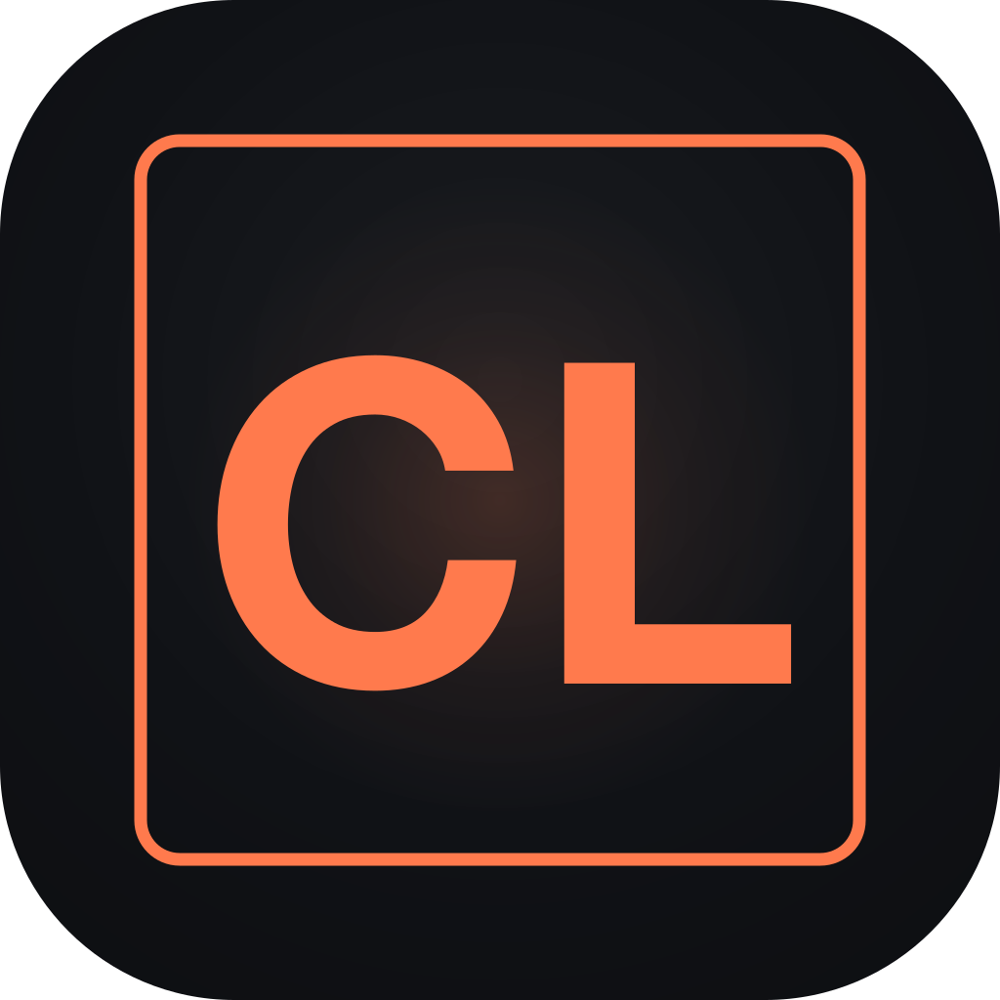
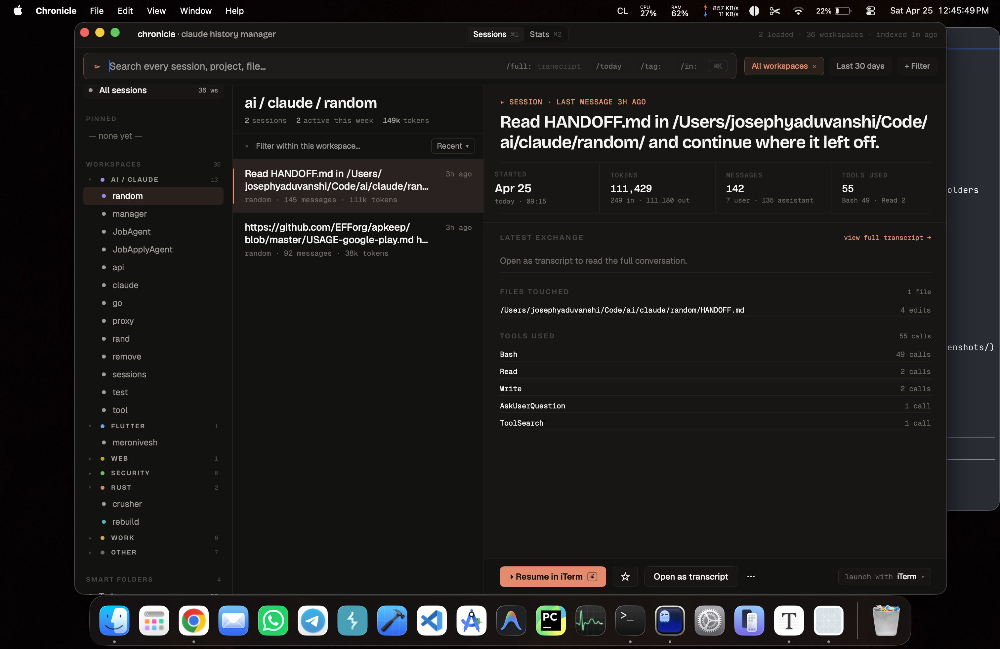
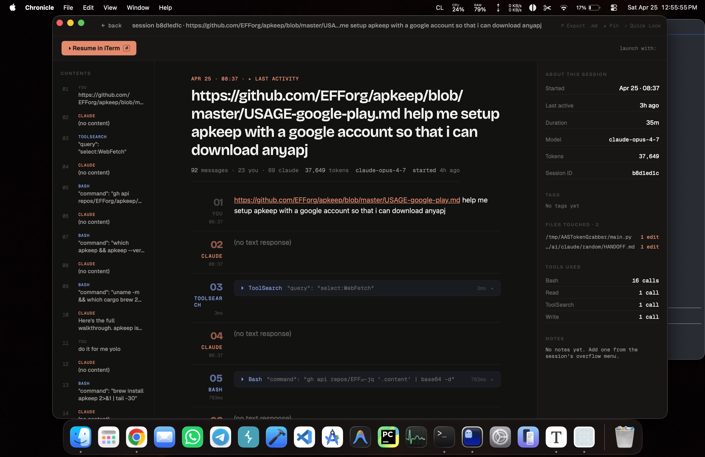
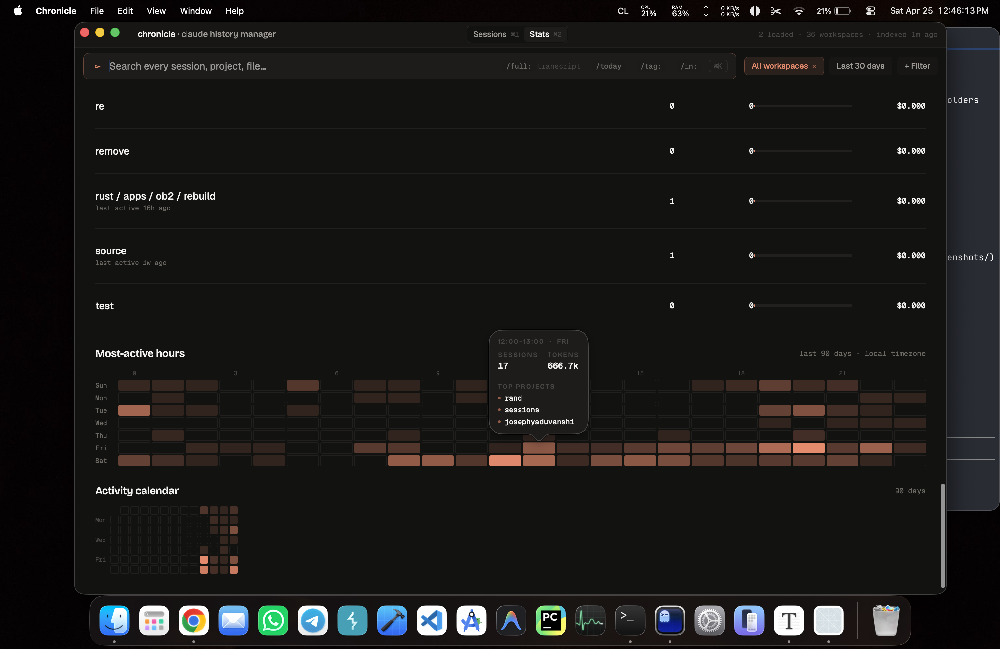

<h1 align="center">
  <br>
  <a href="https://github.com/josephyaduvanshi/claude-history-manager">
    
  </a>
  <br>
  Chronicle
  <br>
</h1>

<p align="center">
  <strong>A native macOS browser for your <a href="https://claude.com/claude-code" target="_blank">Claude Code</a> session history.</strong><br/>
  Reads <code>~/.claude/projects/</code> directly. Indexes everything into local SQLite. Resumes any session in one keystroke.
</p>

<p align="center">
  <a href="https://github.com/josephyaduvanshi/claude-history-manager/releases">
    
  </a>
  <a href="https://github.com/josephyaduvanshi/claude-history-manager/blob/main/LICENSE">
    
  </a>
  
  
  
  
</p>

<p align="center">
  <a href="https://github.com/josephyaduvanshi"></a>
  <a href="https://twitter.com/Josefyaduvanshi"></a>
</p>

<p align="center">
  <em>If this saves you from grepping JSONL files at 1am, star the repo. Thanks.</em>
</p>

<p align="center">
  <a href="#install">Install</a> •
  <a href="#how-it-works">How it works</a> •
  <a href="#features">Features</a> •
  <a href="#privacy">Privacy</a> •
  <a href="#keyboard-shortcuts">Shortcuts</a> •
  <a href="#configuration">Configuration</a> •
  <a href="#faq">FAQ</a> •
  <a href="#license">License</a>
</p>

---

Claude Code writes a JSONL transcript for every session under `~/.claude/projects/`. After a few weeks of real use, that folder is unreadable, ungreppable, and the only way to find the session where you actually solved that one bug is to remember which workspace you were in and scroll through `ls -lt`. Chronicle reads those files directly, indexes every session into a local SQLite database, and gives you somewhere to actually look at them. Pin the ones that matter. Tag the ones you're tracking. Resume any of them in one keystroke, in whichever terminal you prefer.

Transcripts never leave the Mac they were written on.

<p align="center">
  
</p>

---

## Install

### Homebrew (recommended)

```bash
brew tap josephyaduvanshi/chronicle
brew install --cask chronicle
```

The cask handles the download, the drag into `/Applications`, and the Gatekeeper unquarantine step in one go. To update later:

```bash
brew update                              # refreshes the tap; the tap auto-bumps on every release
brew upgrade --cask chronicle
```

If you previously installed Chronicle by dragging the `.app` manually and now want Homebrew to take over, add `--force`:

```bash
brew install --cask chronicle --force    # overwrites the manual install + registers it with brew
```

If `brew install` reports a 404 on the DMG, your local tap cache is stale — run `brew update` first.

Tap source: [josephyaduvanshi/homebrew-chronicle](https://github.com/josephyaduvanshi/homebrew-chronicle).

### Installer (.pkg)

For the lowest-friction install without Homebrew. Download `Chronicle-<version>.pkg` from the latest [GitHub Release](https://github.com/josephyaduvanshi/claude-history-manager/releases), double-click, follow the prompts. The installer drops `Chronicle.app` in `/Applications/` and strips the Gatekeeper quarantine via a postinstall script. macOS will warn that the package isn't signed by an identified developer; right-click the `.pkg` and choose Open the first time.

### Disk image (.dmg)

Download `Chronicle-<version>.dmg` from the [release page](https://github.com/josephyaduvanshi/claude-history-manager/releases), mount it, drag `Chronicle.app` onto the Applications shortcut, then run:

```bash
xattr -cr /Applications/Chronicle.app
```

### Download the .zip

1. Grab `Chronicle-<version>.zip` from the latest [GitHub Release](https://github.com/josephyaduvanshi/claude-history-manager/releases).
2. Unzip and drag `Chronicle.app` into `/Applications/`.
3. Strip the Gatekeeper quarantine attribute so macOS will launch the ad-hoc-signed binary:

   ```bash
   xattr -cr /Applications/Chronicle.app
   ```

4. Open Chronicle. The first launch indexes `~/.claude/projects/` (about 60 to 90 seconds for a few thousand sessions). If the sidebar stays empty, grant Full Disk Access in `System Settings` > `Privacy & Security` > `Full Disk Access` and relaunch.

If you skip the `xattr` step, Chronicle still launches but shows an in-app card with the same one-liner and a copy-to-clipboard button.

> [!NOTE]
> Chronicle is ad-hoc signed, not notarized. Apple notarization needs a paid Developer ID ($99/year) which this project doesn't carry yet. The binary you download is bit-for-bit what the GitHub Actions workflow builds from `main`, and the release page lists the SHA256 if you want to verify.

### Build from source

Chronicle is a pure Swift Package. No Xcode project, no signing setup, no Brewfile. If you have a recent Xcode toolchain installed, you have everything you need.

```bash
git clone https://github.com/josephyaduvanshi/claude-history-manager.git
cd claude-history-manager
swift build -c release
.build/release/Chronicle
```

Running the raw binary works for hacking on it. For a real `.app` bundle (the kind macOS treats like a normal application, with a Dock icon and proper `Info.plist`), use the GitHub Actions workflow at `.github/workflows/release.yml` as a template, or copy the binary into a hand-rolled bundle alongside `Resources/Info.plist.in`.

---

## How it works

Chronicle is a SwiftUI app on top of two boring layers. A parser reads each session's JSON Lines transcript, pulls out title, message count, token usage, model, tools used, and timestamps, then writes that into SQLite via [GRDB](https://github.com/groue/GRDB.swift). A file-system watcher reindexes only the files whose size or `mtime` actually changed, so a warm cache for 35 workspaces and 440 sessions reopens in around 75 milliseconds.

Full-text search hits an FTS5 virtual table that's built lazily the first time you type `/full:`. Everything else (the menubar, the stats dashboard, the heatmaps, the smart folders) runs against the same in-process SQLite handle. There's no daemon, no background process, no helper binary. When the app isn't running, nothing is running.

Bootstrap was originally 35 fsyncs (one per workspace). It's now 1 fsync inside a single `SAVEPOINT`, with workspace metadata cached and `file_mtime` stored as a `REAL` epoch with a 50ms tolerance window so we don't reparse files just because APFS rounded a timestamp differently.

---

## Features

### Search and slash filters

Title search runs against indexed metadata for instant results. Type `/full: error handling` to drop into FTS5 transcript search. Combine filters with `/today`, `/tag:client-work`, `/in:flutter`, `/model:opus`, and free text in any order. The query bar parses left-to-right, so `/in:rust /tag:bug panic` means "Rust workspaces, tagged bug, with the word panic anywhere in the title".

### Workspaces, color-coded

`~/.claude/projects/` stores each project as an encoded folder name like `-Users-you-Code-flutter-myapp`. Chronicle decodes those back into real paths, then buckets each workspace into one of nine categories: AI/CLAUDE, FLUTTER, SECURITY, RUST, GO, PYTHON, WEB, WORK, OTHER. Each category gets its own hue in the sidebar and click-to-collapse headers, so the workspace list stays scannable even when you have 35 of them.

### Smart folders

Built-in: Today, This week, Used `git push`, Errored sessions, Long sessions. You can also save any combined query as a custom folder. The combined filter takes workspace, tag, token range, date range, flags (pinned, archived, has-notes), and free text, all in one folder definition.

### Tags, pins, archive, soft-delete

Right-click any session to pin it, tag it with a color hue, archive it, or move it to Trash with a 30-day undo window. Renaming sticks. Notes stick. Nothing is destructive without a confirmation, and nothing touches the underlying JSONL files.

### Transcript view

Markdown-rendered conversation with [Splash](https://github.com/JohnSundell/Splash)-highlighted code blocks, collapsible tool calls, and a TOC sidebar listing every message and tool call in the session. The right-hand metadata pane shows started-at, duration, model, total tokens, files touched (extracted from `write_file` and `edit` tool events), and tools used.

<p align="center">
  
</p>

### Stats dashboard

Per-project tokens and an estimated cost using the standard pricing tiers. An hour-by-weekday activity heatmap so you can see when you actually work. A 90-day calendar heatmap with hover popovers showing the top three workspaces and total tokens for each day. Both heatmaps are fed by the same in-process SQLite so they update without an extra query layer.

<p align="center">
  
</p>

### Resume in your terminal

`Resume in <Terminal>` launches the selected session in Ghostty, iTerm, Terminal.app, Alacritty, WezTerm, or kitty. Pick a default in Settings, or override per-session from the action bar dropdown. The launcher shells out with the right flags for each terminal (e.g. `ghostty --working-directory=...`, `iTerm` via AppleScript) and degrades gracefully if a terminal isn't installed.

### Open in your editor

`Open in <Editor>` launches alongside the terminal: VS Code, Cursor, Zed, or Xcode. Detection resolves the installed `.app` bundle first, then falls back to a CLI shim on `PATH`. Same per-session override pattern as the terminal launcher.

### Menubar dropdown

Press `⌘⇧O` from anywhere on the system. A 480px popover drops down from the menubar showing live, recent, and pinned sessions, with `⌘1` through `⌘9` to launch any visible row. The same global hotkey toggles it closed. `⌘⇧⏎` resumes the most-recently-modified session in your default terminal without opening any UI at all.

### Live session detection

A green pulse marks sessions Claude Code is currently writing to. Polled every two seconds against the watched directories. Useful when you have three terminals running at once and need to figure out which one is the active conversation.

### iCloud Drive metadata sync

Pins, tags, archive flags, smart folders, custom titles, and notes sync via a single JSON file at `~/Library/Mobile Documents/com~apple~CloudDocs/Chronicle/chronicle-sync.json`. Transcripts stay on the device they were generated on. The sync model is last-write-wins per record with a small per-tag merge so two of your own machines stay consistent. It is not designed for collaborative editing, which Chronicle doesn't support.

### Quick Look

Press `⌘Y` on any selected session for a 300x480 popover preview of the first ~40 lines of the transcript, no full window open. Same gesture as Finder's Quick Look. Esc dismisses.

### Update checker

`Check for updates...` in the app menu hits the GitHub Releases API and shows release notes inline. No Sparkle. No background polling. The only outbound network call the app makes is the one you trigger by clicking that menu item.

---

## Privacy

Chronicle runs entirely on your Mac. The app reads `~/.claude/projects/` and writes a SQLite database to `~/Library/Application Support/Chronicle/chronicle.sqlite`. That's it. Transcripts are not uploaded, summarized, embedded, or sent to any external service.

When you turn iCloud sync on, Chronicle writes one file inside your iCloud Drive: `~/Library/Mobile Documents/com~apple~CloudDocs/Chronicle/chronicle-sync.json`. That file contains tags, pin flags, archive flags, custom titles, notes, and smart-folder definitions. It does not contain transcripts, message bodies, file paths beyond the workspace name, or any session content. If you want to see exactly what's in there, open the file. It's plain JSON.

There is no telemetry, no crash reporter, no analytics, no "anonymous usage data". The only outbound network call the app makes is the GitHub Releases check, and only when you click `Check for updates...`.

---

## Keyboard shortcuts

| Shortcut | Action |
|---|---|
| `⌘K` | Focus the global search field |
| `⌘1` | Switch to the Sessions tab |
| `⌘2` | Switch to the Stats tab |
| `⌘Y` | Quick Look the selected session |
| `⌘,` | Open Settings |
| `⌘⇧O` | Toggle the menubar dropdown from anywhere |
| `⌘⇧⏎` | Resume the most-recently-modified session in your default terminal |
| `↑` / `↓` | Move the selection in any list |
| `⏎` | Resume the selected session in the default terminal |
| `⌘⏎` | Open the terminal picker for the selected session |
| `⌘1`-`⌘9` (in menubar) | Launch the Nth visible row |
| `⎋` | Dismiss the menubar dropdown or any sheet |

---

## Configuration

Settings (`⌘,`) is grouped into four panes:

**Appearance.** Seven named themes, all with full custom palettes — not just light/dark inversions of the same base.

| Theme | Mode | Vibe |
|---|---|---|
| Dark Chronicle | dark | Default. Coral on near-black, the look you see in the screenshots above. |
| Github | light | GitHub Light feel. Blue accent, clean white surfaces. |
| Gothic | dark | Deep purple on near-black. Blood-red highlights. |
| Newsprint | light | Sepia and cream. Warm brown accent. Reads like a paperback. |
| Night | dark | True midnight blue. Cobalt accent. Cold and surgical. |
| Pixyll | light | Tufte-flavored white. Red accent. Sharp narrow rules. |
| Whitey | light | Near-monochrome. Coral accent stays. The minimal end of the spectrum. |

Plus eight coral accent presets and a custom color picker (these only apply to Dark Chronicle and Whitey, the two themes designed around coral). Three density modes: compact, comfortable, spacious. Density affects row height, padding, and the metadata pane's font size.

**Sync.** Toggle iCloud Drive sync on or off. Shows last-pull and last-push timestamps. `Sync now` forces a pull-then-push round trip. Surfaces the last error inline if a write failed (usually because iCloud Drive is paused or the user isn't signed in).

**Terminal.** Pick the default terminal for resume actions. Detects which of Ghostty, iTerm, Terminal.app, Alacritty, WezTerm, and kitty are installed and only shows the available ones.

**Editor.** Pick the default editor for `Open in <Editor>` actions: VS Code, Cursor, Zed, or Xcode. Same install-detection logic as Terminal.

Preferences live in `UserDefaults` under the `chronicle.*` keys. The SQLite database lives at `~/Library/Application Support/Chronicle/chronicle.sqlite`. Removing the support folder gives you a clean re-index on next launch.

---

## FAQ

### Why macOS 15 only?

Chronicle uses SwiftUI features and font APIs (variable-font width and optical sizing on `Font.custom`) that ship in macOS 15. Backporting to 14 means rewriting the type system and dropping a few visual touches. macOS 15 has been out long enough to be widely adopted, so the trade isn't worth it. If you're not on macOS 15, this won't even launch.

### How do I uninstall?

Drag `Chronicle.app` from `/Applications/` to the Trash, then remove the database and preferences:

```bash
rm -rf ~/Library/Application\ Support/Chronicle
defaults delete com.chronicle.app
```

If you turned on iCloud sync and want to wipe the cloud copy too, delete `~/Library/Mobile Documents/com~apple~CloudDocs/Chronicle/`.

### Where is my data stored?

Three places, all on your Mac:

- `~/.claude/projects/`, the source-of-truth JSONL transcripts. Chronicle reads these but never writes to them.
- `~/Library/Application Support/Chronicle/chronicle.sqlite`, the index, plus your pins, tags, notes, custom titles, and smart-folder definitions.
- `~/Library/Mobile Documents/com~apple~CloudDocs/Chronicle/chronicle-sync.json`. Only present if you turned on iCloud sync. Metadata only.

### Is the app sandboxed?

No. Chronicle reads `~/.claude/projects/`, writes to its own Application Support folder, and runs shell commands to launch terminals. None of that works under the App Sandbox. If a future App Store release happens, sandboxing is on the table; for now, the binary is plain and unsandboxed.

### Can I sync to iCloud?

Yes. Toggle it on in Settings > Sync. Only metadata syncs (tags, pins, notes, custom titles, smart-folder definitions). Transcripts stay on the device they were generated on, because they live under `~/.claude/projects/` and Claude Code writes them per-machine.

### Why is the app ad-hoc signed instead of notarized?

Notarization requires a paid Apple Developer ID ($99/year). This project doesn't have one yet. Until that changes, Chronicle ships ad-hoc signed and you'll need to run `xattr -cr /Applications/Chronicle.app` once on first install. The first-launch in-app card detects the quarantine attribute and shows the command with a copy button so you don't have to remember it.

### Is this a Claude Code plugin?

No. Chronicle is a standalone macOS app. It reads the same files Claude Code writes, but it doesn't hook into Claude Code, modify its behaviour, or require it to be running.

### Will it slow down my Mac?

The app idles at near-zero CPU when nothing is changing. The file-system watcher uses FSEvents, not polling, so an inactive Claude Code workspace costs you nothing. The one place that does real work is the initial bootstrap on first launch, which takes 60 to 90 seconds for a few thousand sessions and only happens once.

---

## Contributing

Issues and pull requests are welcome at [github.com/josephyaduvanshi/claude-history-manager](https://github.com/josephyaduvanshi/claude-history-manager). If you're filing a bug, attach the output of `swift --version` and your macOS version. If you're proposing a feature, open an issue first so we can sanity-check the scope before you spend implementation time on it.

Run the tests before sending a PR:

```bash
swift test
```

The test suite uses fixture JSONL files under `ChronicleTests/Fixtures/` so you don't need a populated `~/.claude/projects/` to run it.

---

## License

MIT. See [LICENSE](LICENSE).

The repository also bundles third-party fonts and libraries under their own licenses (MIT and SIL OFL 1.1). Full attributions are in the LICENSE file and the [Credits](#credits) section below.

---

## Credits

Chronicle is built on a small set of excellent libraries and fonts:

- [GRDB.swift](https://github.com/groue/GRDB.swift) for SQLite + FTS5
- [swift-markdown-ui](https://github.com/gonzalezreal/swift-markdown-ui) for transcript rendering
- [NetworkImage](https://github.com/gonzalezreal/NetworkImage) (transitive) for the markdown image loader
- [Splash](https://github.com/JohnSundell/Splash) for code highlighting
- [Bricolage Grotesque](https://github.com/ateliertriay/bricolage) for display type
- [Geist](https://github.com/vercel/geist-font) and Geist Mono for body and monospace

All MIT or SIL OFL 1.1.

---

## Star History

<a href="https://www.star-history.com/?repos=josephyaduvanshi%2Fclaude-history-manager&type=date&legend=bottom-right">
 <picture>
   <source media="(prefers-color-scheme: dark)" srcset="https://api.star-history.com/chart?repos=josephyaduvanshi/claude-history-manager&type=date&theme=dark&legend=top-left" />
   <source media="(prefers-color-scheme: light)" srcset="https://api.star-history.com/chart?repos=josephyaduvanshi/claude-history-manager&type=date&legend=top-left" />
   
 </picture>
</a>

---

<p align="center">
  Built by <a href="https://github.com/josephyaduvanshi">Joseph Yaduvanshi</a><br/>
  <sub>If this saved you an evening, a ⭐ on the repo is the nicest thank-you.</sub>
</p>
